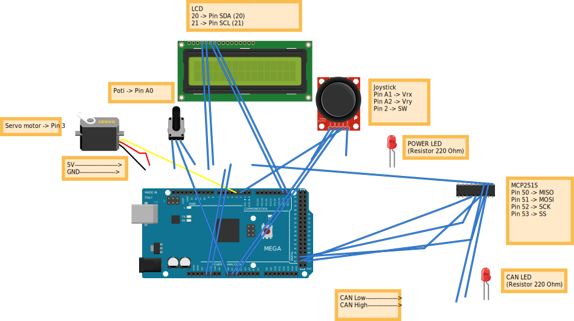
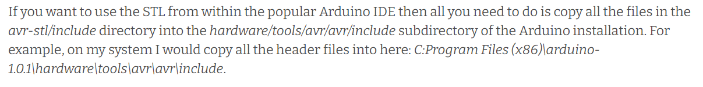
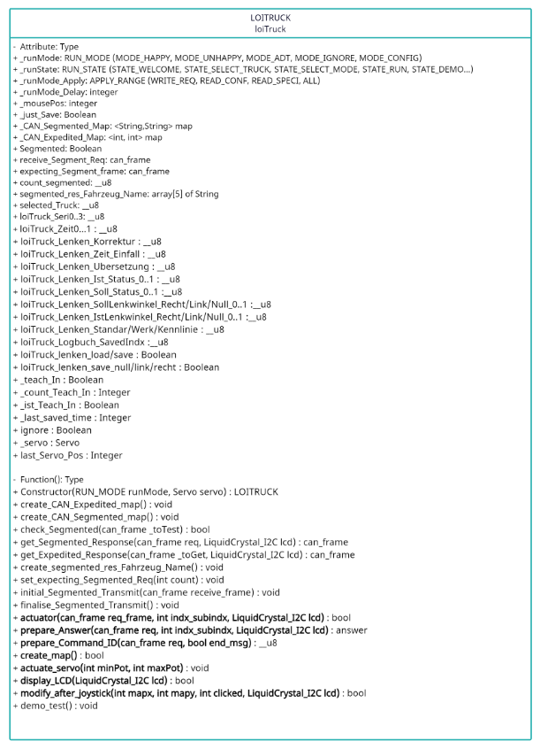
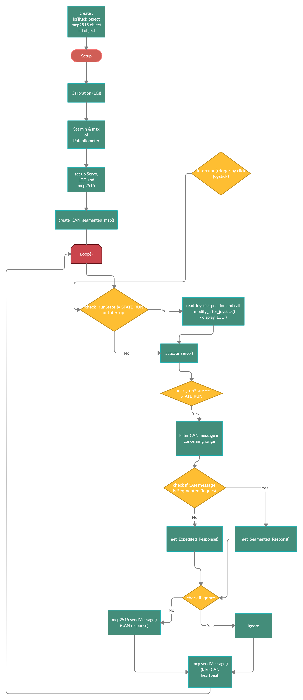

# DOCUMENTATION

----

## Objective

- Simulate different Trucks implementing CAN Open protocol
- Simulate different Error Scenarios by different Running Mode:
    - MODE HAPPY
    - MODE ADT
    - MODE UNHAPPY
    - MODE IGNORE
    - MODE CONFIG (for modification during RUN)
- In combination with those Modes, Range and Delay enable users to simulate errors more freely:
    - Range:
        - WRITE_REQ
        - READ_CONF
        - READ_SPECI
        - ALL
    - Delay:
        - 0 - 2 mil (integer upper boundary, step 100ms)

----

## Requirements

>Hardware
- Board : Arduino Mega 2560
- LCD 20x4 I2C [link LCD]
- Joystick [link Joystick]
- CAN module MCP2515 [link MCP]
- 1xServo Motor
- 2xLED
- 2x220 Ohm resistors
- 2xBreadboars

[link LCD]: https://www.amazon.de/SunFounder-Serial-Arduino-Mega2560-IIC2004/dp/B01GPUMP9C/ref=asc_df_B01GPUMP9C/?tag=googshopde-21&linkCode=df0&hvadid=309955879354&hvpos=&hvnetw=g&hvrand=17007324613408845966&hvpone=&hvptwo=&hvqmt=&hvdev=c&hvdvcmdl=&hvlocint=&hvlocphy=9043559&hvtargid=pla-572925702212&psc=1&th=1&psc=1&tag=&ref=&adgrpid=61302520443&hvpone=&hvptwo=&hvadid=309955879354&hvpos=&hvnetw=g&hvrand=17007324613408845966&hvqmt=&hvdev=c&hvdvcmdl=&hvlocint=&hvlocphy=9043559&hvtargid=pla-572925702212
[link Joystick]: https://www.reichelt.de/de/de/entwicklerboards-joystick-modul-debo-thumb-joy-p239254.html?PROVID=2788&gclid=Cj0KCQjw5uWGBhCTARIsAL70sLJHHHH1-nO5mFu5e82Zeq3ZaQQquua2n3wwcwOz8eTeXlqD78cR9JwaAuAOEALw_wcB&&r=1
[link MCP]: https://www.az-delivery.de/en/products/mcp2515-can-bus-modul

>Software
- Arduino IDE
- MCP2515 lib [link lib MCP2515]
- LCD Lib [link lib LCD]#
- Avr-stl (for C++ command, container)[link lib AVR]
    

[link lib MCP2515]: https://github.com/autowp/arduino-mcp2515
[link lib LCD]: https://github.com/fdebrabander/Arduino-LiquidCrystal-I2C-library/blob/master/LiquidCrystal_I2C.h
[link lib AVR]: https://andybrown.me.uk/downloads/

*How to import a library into Arduino IDE ?* [import lib]

[import lib]: https://www.arduino.cc/en/guide/libraries

>Setup on Arduino IDE
- Select Board (Tools -> Board -> Arduino Mega or Mega 2560)
- Select Port (Tools -> Port -> ..)
- Set baudrate for Serial Monitor (250000)

----

## App Description

### Structure

Three important objects using in the app
- mcp2515
- lcd
- loiTruck
    
    
    
### Underlying Run Mode Logic
>CAN Message Classification

    -   Write Command (Command ID == 0x2_)
    -   Read Command (Command ID == 0x4_)
    -   Read Confirm (Read Command right after Write Command)
    -   Read Speci (Command ID == 0x4_ and Indx_Subindx == Selected Indx_Subindx)
        -   Indx_Subindx = Byte_3 (reversed) + Byte_4 (exp: 0x20021) 

>MODE HAPPY (default Mode)

    -   Write Command : reply 0x60 and confirm correctly
    -   Read Command : reply 0x4_ and value
    -   Select Range not really make sense in MODE HAPPY since all CAN Messages are replied under HAPPY logic by default
    -   Delay is applied base on Range Selection (Write Command,Read Confirm, Read Speci or All)

>MODE ADT

    -   Write Command : reply 0x80 (Abort) + Error Code (sub index does not exist) if Range == WRITE_REQ
    -   Read Confirm : reply 0x80 (Abort) + Error Code (sub index does not exist) if Range == READ_CONF
    -   Read Speci : reply 0x80 (Abort) + Error Code  (sub index does not exist) if Range == READ_SPECI and Indx_Subindx == Selected Indx_Subindx
    -   Read Command : reply 0x80 (Abort) + Error Code (sub index does not exist) if Range == ALL    
    -   Delay is applied base on Range Selection (Write Command,Read Confirm, Read Speci or All)

>MODE UNHAPPY

    -   Write Command : reply 0x60 + 0000 -> Read Confirm : reply 0x4_ + wrong value ( -1 from saved value) if Range == WRITE_REQ
    -   Read Confirm : reply 0x4_ + 0000 (value still be saved wrongly -1) if Range == READ_CONF
    -   Read Speci : reply 0x4_ + 0000 if Range == READ_SPECI and Indx_Subindx == Selected Indx_Subindx
    -   Read Command : reply 0x4x + 0000 if Range == ALL
    -   Delay is applied base on Range Selection (Write Command,Read Confirm, Read Speci or All)

>MODE IGNORE

    -   Write Command : not reply if Range == WRITE_REQ
    -   Read Confirm : not reply if Range == READ_CONF
    -   Read Speci : not reply if Range == READ_SPECI and Indx_Subindx == Selected Indx_Subindx
    -   Read Command (Command ID == 0x4_) : not reply if Range = ALL
    -   Delay is applied base on Range Selection (Write Command,Read Confirm, Read Speci or All)

>MODE CONFIG

    -   Allow update Range & Delay during RUN 
    -   Might add some unexpected delay due to overhead of listening to the joystick -> recommend to use this mode only for modification then return to 1 of 4 default mode to simulate
# WORK FLOW

